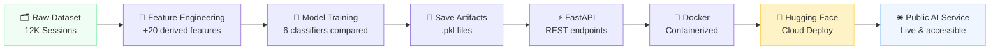
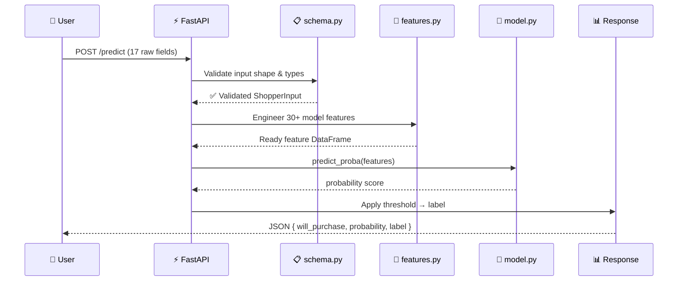

<!-- ---
title: Online Shoppers API
emoji: 🛒
colorFrom: blue
colorTo: green
sdk: docker
app_port: 8000
pinned: false
--- -->

<div align="center">

# 🛒 Online Shoppers Purchase Prediction API

### *From Notebook Experiment to Public AI Service*

[](https://www.python.org/)
[](https://fastapi.tiangolo.com/)
[](https://scikit-learn.org/)
[](https://www.docker.com/)
[](https://huggingface.co/spaces)
[](LICENSE)
[](https://xstynwx-online-shoppers-api.hf.space/health)

<br/>

**A production-ready machine learning API that predicts whether an online shopping session will result in a purchase — deployed publicly on Hugging Face Spaces.**

[🚀 Live Website](https://dsc-ureeka.vercel.app/) · [📖 Swagger Docs](https://xstynwx-online-shoppers-api.hf.space/docs) · [📊 Dataset Docs](https://dsc-ureeka.vercel.app/docs.html)

</div>

---

## 📌 Overview

This project bridges the gap between **machine learning experimentation** and **real-world deployment**. A trained `HistGradientBoostingClassifier` is wrapped in a FastAPI application, containerized with Docker, and hosted publicly on Hugging Face Spaces — accessible to anyone, anywhere, instantly.

> **The core question the model answers:**
> *"Based on this visitor's browsing session, will they make a purchase?"*

| | |
|---|---|
| **Dataset** | [Online Shoppers Intention](https://www.kaggle.com/datasets/henrysue/online-shoppers-intention) — 12,330 sessions |
| **Model** | HistGradientBoostingClassifier (best of 6 models trained) |
| **PR-AUC** | 0.7585 (CV) · 0.7415 (test) |
| **ROC-AUC** | 0.9327 (test) |
| **Accuracy** | 90.5% (test) |
| **Threshold** | 0.49 (F1-optimized) |

---

## 🌐 Live Demo

The API is publicly deployed and ready to use — no setup required.

| Endpoint | URL |
|---|---|
| 🏠 Base URL | `https://xstynwx-online-shoppers-api.hf.space` |
| 📖 Swagger UI | `https://xstynwx-online-shoppers-api.hf.space/docs` |
| ❤️ Health Check | `https://xstynwx-online-shoppers-api.hf.space/health` |
| 🚀 Live Website | `https://dsc-ureeka.vercel.app/` |
| 📊 Dataset Docs | `https://dsc-ureeka.vercel.app/docs.html` |

**Quick test — try it in your terminal:**

```bash
curl -X POST "https://xstynwx-online-shoppers-api.hf.space/predict" \
     -H "Content-Type: application/json" \
     -d '{
       "Administrative": 2, "Administrative_Duration": 0,
       "Informational": 0, "Informational_Duration": 0,
       "ProductRelated": 15, "ProductRelated_Duration": 1020.5,
       "BounceRates": 0.3, "ExitRates": 0.05, "PageValues": 125.3,
       "SpecialDay": 0, "Month": "Nov", "OperatingSystems": 2,
       "Browser": 4, "Region": 1, "TrafficType": 2,
       "VisitorType": "Returning_Visitor", "Weekend": true
     }'
```

**Response:**
```json
{
  "will_purchase": true,
  "prediction": 1,
  "prediction_label": "Will Purchase",
  "probability": 0.8134,
  "threshold": 0.49
}
```

---

## 🔁 Machine Learning Pipeline



---

## ✨ Features

- ⚡ **Real-time prediction** — sub-second inference via REST API
- 📖 **Auto-generated Swagger docs** — interactive testing at `/docs`
- 🛡️ **Pydantic input validation** — type-safe request handling
- 🔧 **Full feature engineering pipeline** — raw inputs automatically transformed
- 🎯 **Probability-based output** — confidence score + threshold comparison
- 🐳 **Docker containerized** — consistent across all environments
- ☁️ **Public cloud deployment** — live on Hugging Face Spaces
- 📊 **Threshold tuning** — F1-optimized decision boundary at 0.49

---

## 🛠️ Tech Stack

| Layer | Technology | Purpose |
|---|---|---|
| **Language** | Python 3.11 | Core runtime |
| **API Framework** | FastAPI | REST API, auto-docs, async support |
| **ML Library** | scikit-learn 1.6 | Model training & inference |
| **Data Processing** | pandas, NumPy | Feature engineering pipeline |
| **Model Serialization** | joblib | Save/load `.pkl` artifacts |
| **Validation** | Pydantic | Request/response schema enforcement |
| **Server** | Uvicorn | ASGI production server |
| **Containerization** | Docker | Reproducible deployment environment |
| **Cloud Hosting** | Hugging Face Spaces | Free public API deployment |
| **Development** | GitHub Codespaces | Cloud-based dev environment |

---

## 📁 Project Structure

```
online-shoppers-api/
│
├── 📄 main.py                   # FastAPI app — endpoints, routing, response logic
├── 📄 schema.py                 # Pydantic models — input & output shapes
├── 📄 features.py               # Feature engineering — recreates Session 1 pipeline
├── 📄 model.py                  # Artifact loader — model, threshold, column order
│
├── 📄 requirements.txt          # Python dependencies
├── 📄 Dockerfile                # Container build instructions
├── 📄 .dockerignore             # Files excluded from Docker image
│
└── 📂 artifacts/
    ├── 🧠 online_shoppers_model.pkl   # Trained HistGradientBoostingClassifier
    ├── 🎯 threshold.pkl               # Optimal decision threshold (0.49)
    └── 📋 model_columns.pkl           # Exact feature column order from training
```

<details>
<summary><b>Why each file exists</b></summary>

<br/>

| File | Role |
|---|---|
| `main.py` | The **front door**. Receives HTTP requests, coordinates the prediction flow, returns JSON. |
| `schema.py` | The **contract**. Defines exactly what input is accepted and what output is returned. FastAPI enforces this automatically. |
| `features.py` | The **translator**. Transforms simple raw user input into the 30+ column feature matrix the model expects — mirroring Session 1 exactly. |
| `model.py` | The **loader**. Reads the three `.pkl` files once at startup and holds them in memory for fast inference. |
| `artifacts/*.pkl` | The **brain**. Serialized outputs from Session 1 training — the model, threshold, and column order. |
| `Dockerfile` | The **lunchbox**. Packages the entire app — code, model, and dependencies — into a portable container. |

</details>

---

## ⚙️ How the API Works



**In plain English:**
```
User sends 17 raw fields
    → FastAPI validates the shape
    → features.py builds 30+ model-ready columns
    → model predicts a probability
    → threshold converts probability to a label
    → API returns structured JSON
```

---

## 📡 API Endpoints

### `GET /health`

Checks whether the API is running.

```bash
curl https://xstynwx-online-shoppers-api.hf.space/health
```

```json
{ "status": "ok" }
```

---

### `POST /predict`

Predicts purchase intent from a shopper session.

**Request body** (all 17 fields required):

```json
{
  "Administrative":            2,
  "Administrative_Duration":   0.0,
  "Informational":             0,
  "Informational_Duration":    0.0,
  "ProductRelated":            15,
  "ProductRelated_Duration":   1020.5,
  "BounceRates":               0.30,
  "ExitRates":                 0.05,
  "PageValues":                125.3,
  "SpecialDay":                0.0,
  "Month":                     "Nov",
  "OperatingSystems":          2,
  "Browser":                   4,
  "Region":                    1,
  "TrafficType":               2,
  "VisitorType":               "Returning_Visitor",
  "Weekend":                   true
}
```

**Response:**

```json
{
  "will_purchase":    true,
  "prediction":       1,
  "prediction_label": "Will Purchase",
  "probability":      0.8134,
  "threshold":        0.49
}
```

**Reading the result:**

| Field | Meaning |
|---|---|
| `will_purchase` | `true` if probability ≥ threshold, else `false` |
| `prediction` | `1` = purchase, `0` = no purchase |
| `prediction_label` | Human-readable: `"Will Purchase"` or `"Will Not Purchase"` |
| `probability` | Model's estimated purchase probability (0.0 – 1.0) |
| `threshold` | Decision cutoff from F1 tuning — fixed at `0.49` |

---

## 💻 Local Development

**1. Clone the repository**

```bash
git clone https://github.com/StyNW7/deploying-the-classifier-dsc-ureeka
cd deploying-the-classifier-dsc-ureeka
```

**2. Create a virtual environment**

```bash
# Windows
py -3.11 -m venv venv
.\venv\Scripts\python.exe -m pip install -r requirements.txt

# macOS / Linux
python3.11 -m venv venv
source venv/bin/activate
pip install -r requirements.txt
```

**3. Run the API**

```bash
# Windows (recommended — avoids activation issues)
.\venv\Scripts\python.exe -m uvicorn main:app --reload

# macOS / Linux
uvicorn main:app --reload
```

**4. Open in browser**

```
http://localhost:8000/docs
```

> Swagger UI opens automatically — test the API interactively without writing any code.

---

## 🐳 Docker

Docker packages the entire app — code, model, and environment — into a portable container. Recommended before deploying to Hugging Face.

> ⚠️ **Note:** Docker may not work if files are saved inside OneDrive (symlink conflicts). Move the project to a local folder first.

**Build the image:**

```bash
docker build -t shoppers-api .
```

**Run the container:**

```bash
docker run -p 8000:8000 shoppers-api
```

**Test it:**

```
http://localhost:8000/docs
```

If Swagger loads and `/health` returns `ok`, the container is working correctly — and the app is ready to deploy.

---

## ☁️ GitHub Codespaces

Run the API entirely in the cloud — no local setup required.

1. Open the repository on GitHub
2. Click **Code → Codespaces → Create codespace on main**
3. Wait for the environment to build, then run:

```bash
pip install -r requirements.txt
uvicorn main:app --reload --host 0.0.0.0 --port 8000
```

4. Codespaces will auto-forward port `8000` — click the link to open Swagger UI.

---

## 🤗 Hugging Face Spaces Deployment

Hugging Face Spaces hosts the Docker container as a free public API.

**Steps:**

1. Go to [huggingface.co](https://huggingface.co) and log in
2. Click your profile → **New Space**
3. Name your Space (e.g. `online-shoppers-api`)
4. Select **Docker** as the SDK · set **App Port** to `8000`
5. Upload these files (do **not** upload `venv/`):

```
main.py
schema.py
features.py
model.py
requirements.txt
Dockerfile
artifacts/online_shoppers_model.pkl
artifacts/threshold.pkl
artifacts/model_columns.pkl
```

6. Hugging Face builds the Docker image automatically.
7. When the build finishes, visit:

```
https://YOUR-USERNAME-YOUR-SPACE-NAME.hf.space/docs
```

✅ If Swagger loads and `/health` returns `ok` — deployment is successful.

---

## 🔬 Machine Learning Details

<details>
<summary><b>Model selection & training</b></summary>

<br/>

Six classifiers were trained and evaluated using **5-fold Stratified Cross-Validation** with **PR-AUC** as the scoring metric (optimal for imbalanced classification):

| Model | CV PR-AUC |
|---|---|
| 🥇 HistGradientBoostingClassifier | **0.7585** |
| Soft Voting Ensemble | 0.7561 |
| Gradient Boosting | 0.7541 |
| Random Forest | 0.7538 |
| Extra Trees | 0.7391 |
| Logistic Regression | 0.6644 |

All models used `RandomizedSearchCV` for hyperparameter tuning. HistGradientBoosting was selected as the final model.

</details>

<details>
<summary><b>Feature engineering</b></summary>

<br/>

The raw 17 input fields are transformed into 30+ model-ready features inside `features.py`. Key engineered features:

| Feature | Formula | Why |
|---|---|---|
| `TotalDuration` | sum of all page durations | Overall session engagement |
| `TotalPages` | sum of all page counts | Breadth of exploration |
| `ProductDurationPerPage` | `ProductRelated_Duration / ProductRelated` | Depth per product page |
| `ProductEngagement` | `ProductRelated × ProductRelated_Duration` | Composite buying-intent score |
| `ExitBounceGap` | `ExitRates − BounceRates` | Exit pattern beyond bouncing |
| `ProductPageRatio` | `ProductRelated / TotalPages` | Session focus on products |
| `*_log` features | `log1p(duration)` | Compress right-skewed distributions |

> ⚠️ The feature engineering in `features.py` must exactly match Session 1. If they differ, the model receives incorrect data and predictions become unreliable.

</details>

<details>
<summary><b>Threshold tuning</b></summary>

<br/>

By default, classifiers use `0.50` as the decision threshold. This project swept thresholds from `0.05` to `0.90` and selected the value that maximized **F1-score** on the purchase class:

```
Best threshold: 0.49

probability ≥ 0.49  →  "Will Purchase"
probability < 0.49  →  "Will Not Purchase"
```

This slight shift from `0.50` improves recall on the minority (purchase) class without sacrificing too much precision.

</details>

<details>
<summary><b>Why model_columns.pkl matters</b></summary>

<br/>

ML models are sensitive to feature column order. If `features.py` produces columns in a different order than training, the model silently receives wrong data.

`model_columns.pkl` stores the exact column list from Session 1 and is used by `model.py` to reindex the feature DataFrame before inference — ensuring the order is always correct.

```python
# Recreate from Session 1 if needed:
import joblib
joblib.dump(num_cols + cat_cols, "model_columns.pkl")
```

</details>

---

## 🚀 Future Improvements

- [ ] **Prediction logging** — store inputs/outputs in a database for monitoring
- [ ] **User authentication** — API key or OAuth2 protection
- [ ] **Drift detection** — alert when input distribution shifts from training data
- [ ] **CI/CD pipeline** — automated testing and deployment on push
- [ ] **MLOps integration** — model versioning with MLflow or DVC
- [ ] **Batch prediction endpoint** — predict multiple sessions in one request
- [ ] **A/B model serving** — compare model versions in production

---

## 🛠️ Troubleshooting

<details>
<summary><b>PowerShell blocks venv activation</b></summary>

<br/>

If `venv\Scripts\activate` fails, call the venv Python directly — no activation needed:

```powershell
.\venv\Scripts\python.exe -m uvicorn main:app --reload
.\venv\Scripts\python.exe -m pip install -r requirements.txt
```

</details>

<details>
<summary><b>ModuleNotFoundError</b></summary>

<br/>

A package is missing. Run:

```powershell
.\venv\Scripts\python.exe -m pip install -r requirements.txt
```

</details>

<details>
<summary><b>Artifact not found (.pkl files)</b></summary>

<br/>

All three artifact files must live inside the `artifacts/` folder:

```
artifacts/online_shoppers_model.pkl
artifacts/threshold.pkl
artifacts/model_columns.pkl
```

If `model_columns.pkl` is missing, recreate it from Session 1:

```python
import joblib
joblib.dump(num_cols + cat_cols, "artifacts/model_columns.pkl")
```

</details>

<details>
<summary><b>Predictions seem wrong</b></summary>

<br/>

The most common cause: `features.py` in Session 2 does not match the feature engineering from Session 1.

**Rule:** The data preparation at training time and inference time must be identical — same columns, same formulas, same order.

Check `features.py` against the Session 1 notebook carefully.

</details>

---

## 🎓 Workshop Context

<div align="center">

Built for the

### **DSC × Ureeka Workshop 2026**

*"Beyond the Model: Bridging Machine Learning and Real-World Deployment"*

</div>

This project is **Session 2** of a two-part workshop series:

| Session | Focus | Output |
|---|---|---|
| **Session 1** | Data cleaning, feature engineering, model training, and evaluation | `model.pkl`, `threshold.pkl`, `model_columns.pkl` |
| **Session 2** *(this repo)* | Wrapping the model in FastAPI, containerizing with Docker, deploying to the cloud | Live public API on Hugging Face Spaces |

The goal: show that **a machine learning model only creates real-world impact when it can reach real users** — not just when it scores well in a notebook.

---

## 👤 Contributor

<div align="center">

| | |
|---|---|
| **Author** | Stanley Nathanael Wijaya |
| **Event** | DSC × Ureeka Workshop 2026 |
| **Role** | Workshop Speaker — Deploy the Classifier |

</div>

---

## 📄 License

This project is licensed under the **MIT License** — free to use, modify, and distribute.

```
MIT License

Copyright (c) 2026 Stanley Nathanael Wijaya

Permission is hereby granted, free of charge, to any person obtaining a copy
of this software and associated documentation files (the "Software"), to deal
in the Software without restriction, including without limitation the rights
to use, copy, modify, merge, publish, distribute, sublicense, and/or sell
copies of the Software.
```

---

<div align="center">

**Session 1 → Session 2 Checklist**

| Session 1 produces | Session 2 needs |
|---|---|
| `online_shoppers_model.pkl` | ✅ |
| `threshold.pkl` | ✅ |
| `model_columns.pkl` | ✅ |
| Feature engineering logic | Replicated in `features.py` |

<br/>

*"A machine learning model becomes impactful only when it can reach real users."*

<br/>

[](https://xstynwx-online-shoppers-api.hf.space)
[](https://xstynwx-online-shoppers-api.hf.space/docs)

<br/>

Made with ❤️ for **DSC × Ureeka Workshop 2026**

</div>
